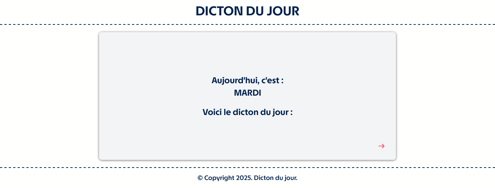
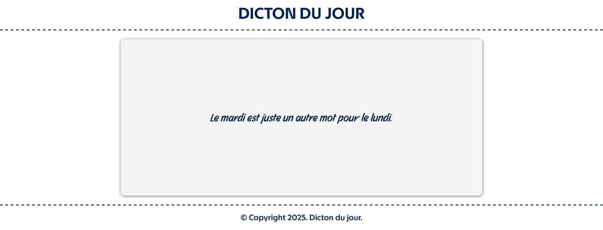

## DICTON DU JOUR APP

RECTO DE LA CARTE:

VERSO DE LA CARTE :

## Le challenge

Création d'une simple application "Dicton du jour" en HTML5, CSS3 et JavaScript.
Cette application affiche le jour et une citation sur le jour en question.

## Démonstration

Lien vers le projet : https://aperbet56.github.io/dicton_du_jour/

## Projet développé avec

- Utilisation des balises sémantiques HTML5
- CSS3
- Flexbox
- Animations css (transition)
- Desktop first
- Page web responsive
- Utilisation d'un normaliseur : le fichier normalize.css
- Importation des polices "Story Script" et "TASA Explorer"
- Commentaires HTML
- Commentaires CSS
- JavaScript (switch case)
- Code JavaScript commenté
